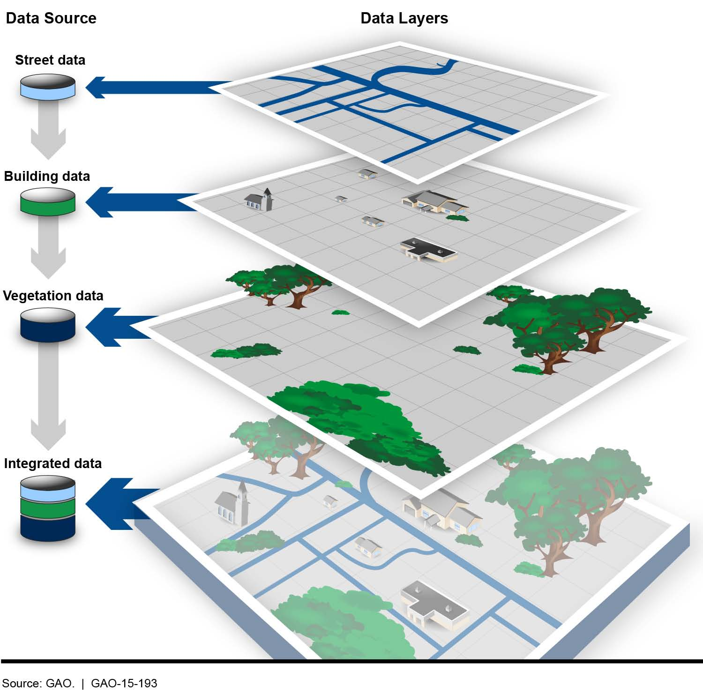

::: {style="text-align: justify"}
GIS is an acronym that is typically used to refer to a geographic information system. We can define a GIS as any software able to read, store, analyze, combine and manipulate spatially referenced data. The main conceptual feature of a geographic information system is that it can *layer* data based on their co-location such that seemingly unrelated data can be combined based on the fact they are located in the same area (see @fig-layer).

{#fig-layer fig-align="center"}

Tipically GIS represent spatial data in two different formats (or combinations of both):

-   Vector data: represent spatial features with points, lines and polygons.
-   Raster data: represent spatial features with grids of pixels.

For all intents and purposes, R can be used as a GIS. Following I provide some examples on how to deal with vector data in R. See [GIS with R - Raster data](https://g-bez.github.io/my-portfolio/posts/gis_raster/) for more examples about raster data.
:::
